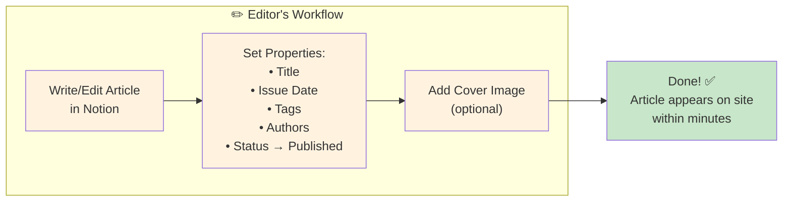
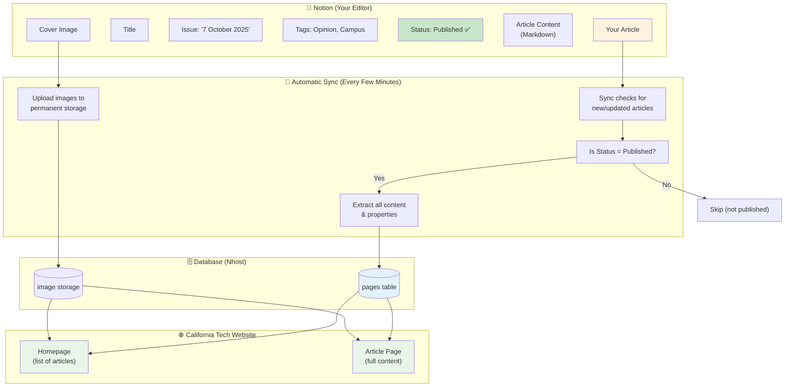
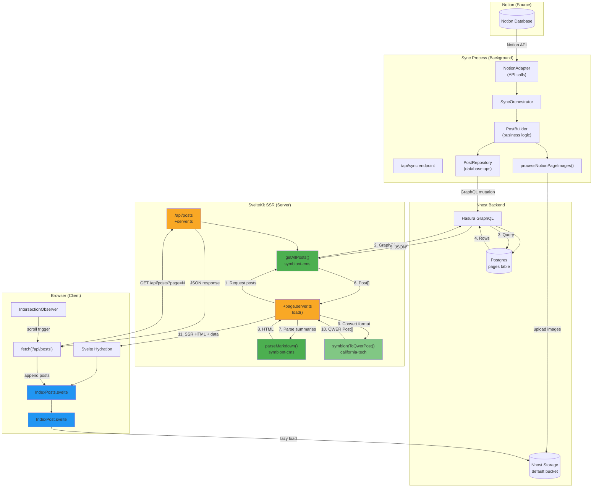
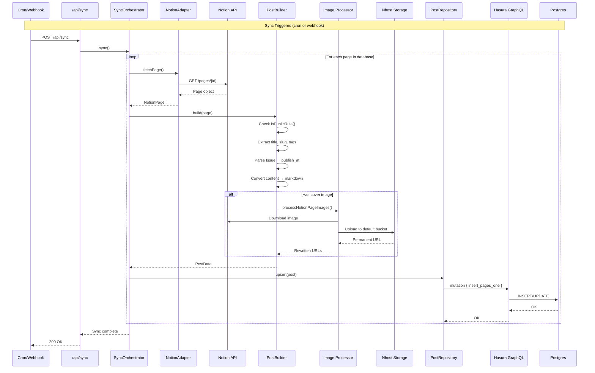
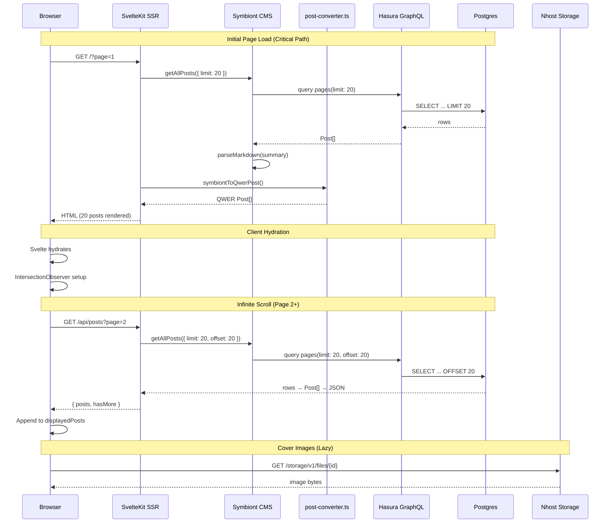

# California Tech Website - Next Batch of Revisions

**Date:** January 8, 2026  
**Updated:** January 17, 2026  
**Status:** In Progress

---

## 🎯 Executive Summary

This memo outlines the next batch of improvements for the California Tech website and its integration with Symbiont CMS:

1. **Date-Based Dividers** - Group posts by issue date instead of year
2. **Markdown in Previews** - Parse markdown in post card summaries
3. **Cover Images** - Wire Phase 2 media sync for cover images
4. **Infinite Scroll** - Paginated loading with graceful degradation

---

## 📍 Current Status

### ✅ Recently Fixed
- **Homepage Posts Visibility**: Posts now displaying correctly (local dev regression resolved)

### 🟢 Symbiont CMS Core (Phase 1)
- ✅ Content Sync: Notion → Postgres pipeline functional
- ✅ Markdown Pipeline: Server-side rendering with `markdown-it`
- ✅ Testing: Basic unit tests (Vitest)
- � Image Pipeline: Hash-based deduplication in progress (see Revision 3)

### 🎨 Current Architecture
- **Framework**: SvelteKit with SSR
- **Homepage**: `index_posts.svelte` → `index_post.svelte` cards
- **Grouping**: ✅ Now by issue date (Jan 17, 2026)
- **Data Flow**: `+page.server.ts` → `getAllPosts()` → `symbiontToQwerPost()` → components

---

## 🎯 Proposed Revisions

### 1. Date-Based Dividers (Replacing Year Dividers)

**Priority:** High | **Complexity:** Low | **Status:** ✅ Completed (Jan 17, 2026)

**Location:** [index_posts.svelte](../packages/california-tech/src/lib/components/index_posts.svelte#L27-L38)

#### Current
```svelte
{@const years = [new Date().getFullYear()]}
{#each posts as p, index (p.slug)}
  {@const year = new Date(p.published).getFullYear()}
  {#if !isNaN(year) && !years.includes(year)}
    <div class="year-divider">{years.push(year) && year}</div>
  {/if}
  <IndexPost data={p} {index} />
{/each}
```

#### Proposed
```svelte
{@const seenDates = new Set<string>()}
{#each posts as p, index (p.slug)}
  {@const publishDate = new Date(p.published)}
  {@const dateKey = publishDate.toLocaleDateString('en-US', { 
    year: 'numeric', month: 'long', day: 'numeric' 
  })}
  
  {#if !seenDates.has(dateKey)}
    <div class="issue-divider">
      {seenDates.add(dateKey) && dateKey}
    </div>
  {/if}
  <IndexPost data={p} {index} />
{/each}
```

**Display:** `"October 7, 2025"` (from Notion Issue property `"7 October 2025"`)

---

### 2. Markdown Parsing in Post Card Previews

**Priority:** High | **Complexity:** Low | **Status:** ✅ Completed (Jan 17, 2026)

**Location:** [index_post.svelte](../packages/california-tech/src/lib/components/index_post.svelte#L101)

#### Problem
Raw markdown displays as plain text (`**bold**` instead of **bold**)

#### Architecture Decision
Follow the same "spoon-feeding" pattern as `postLoad()`:
- **`postLoad()`** wraps `getPostBySlug()` and returns `PostLoadResult` with HTML already parsed
- **Need equivalent for lists:** New `postsLoad()` function that wraps `getAllPosts()` and parses summaries
- **Eliminates boilerplate** in host code - just `export const load = postsLoad`

#### Solution

**1. Add `postsLoad()` to Symbiont CMS** (`symbiont-cms/src/lib/server/index.ts`):
```typescript
import { parseMarkdown } from './markdown-processor';

export interface PostsLoadOptions {
  limit?: number;
  offset?: number;
  parseSummaries?: boolean; // default true
}

export async function postsLoad(
  { fetch }: { fetch: typeof global.fetch },
  options: PostsLoadOptions = {}
) {
  const { limit, offset, parseSummaries = true } = options;
  
  const posts = await getAllPosts({ fetch, limit, offset });
  
  if (parseSummaries) {
    return await Promise.all(
      posts.map(async (post) => {
        if (post.summary) {
          const { html } = await parseMarkdown(post.summary, undefined);
          return {
            ...post,
            summary_html: html.replace(/<\/?p>/g, '') // Strip wrapper <p> tags
          };
        }
        return post;
      })
    );
  }
  
  return posts;
}
```

**2. Use in California Tech** (`+page.server.ts`):
```typescript
import { postsLoad } from 'symbiont-cms/server';
import { symbiontToQwerPost } from '$lib/utils/post-converter';

export async function load({ fetch, url }) {
  const postsFromDb = await postsLoad({ fetch }, { limit: 1000 });
  const allPosts = postsFromDb.map(post => symbiontToQwerPost(post));
  // ... rest of logic
}
```

**3. Update component to use HTML:**
```svelte
<p class="text-lg line-clamp-2" itemprop="description">
  {@html data.summary_html || data.summary}
</p>
```

**4. Update `Post` type in Symbiont:**
```typescript
export interface Post {
  // ... existing fields
  summary?: string;      // Raw markdown
  summary_html?: string; // Parsed HTML (populated by postsLoad)
}
```

#### Benefits
- **Consistent API:** Mirrors `postLoad()` pattern
- **Zero boilerplate:** Host just calls `postsLoad()` and gets presentation-ready data
- **Config-driven:** Uses markdown-it config from `symbiont.config.ts`
- **Optional:** Can disable parsing with `parseSummaries: false` if needed

---

### 3. Cover Images (Phase 2 Media Sync)

**Priority:** High | **Complexity:** High | **Status:** 🔨 In Progress (Jan 17, 2026)

#### Current Status (Updated Jan 17)
- Post cards support covers via `index_post.svelte`
- Cover extraction implemented from Notion database property (`coverProperty` config)
- **Critical:** Notion CDN URLs expire after 1 hour
- **Architecture Decision:** Hash-based deduplication (see below)

#### Nhost Storage Status
Storage already configured via Hasura metadata:
- `nhost/metadata/databases/default/tables/storage_files.yaml`
- `nhost/metadata/databases/default/tables/storage_buckets.yaml`
- **Web instance:** Files uploaded to `default` bucket
- **Local dev:** Empty (needs sync or re-upload)
- **Alternative:** Dedicated bucket for multisite (evaluate later)

#### Implementation Progress

**✅ Completed:**
- Added `coverProperty` config field to DatabaseBlueprint
- Nhost client initialization with admin authentication
- Cover extraction from `page.properties[coverProperty]`
- Handle both `file.type === 'file'` (Notion-hosted) and `file.type === 'external'` (already permanent)
- Store cover URL in `meta.cover` JSONB field
- `uploadImage()` utility for single image uploads

**🔨 In Progress:**
- Hash-based deduplication to avoid re-uploading same images
- Query Nhost Storage by hash before uploading

#### Architecture: Hash-Based Deduplication

**Decision Rationale:**
After discussing proxy endpoint approach (`/api/images/[...path]`), we decided hash-based deduplication is superior for a general-purpose CMS:

**Advantages:**
1. **No deployment dependency**: First sync works in local dev immediately (Nhost URLs work from anywhere)
2. **Notion links never break**: Original URLs stay in Notion until they expire naturally
3. **No duplicate uploads**: Check hash before uploading (saves bandwidth and storage)
4. **Simple adoption workflow**: Configure → Sync → Works (no need to deploy proxy endpoint first)
5. **Database is source of truth**: Has permanent Nhost URLs regardless of Notion's state

**Disadvantages of Proxy Endpoint Approach:**
- Requires deploying API endpoint before images work
- All existing Notion URLs would break during transition period
- More complex for new Symbiont adopters
- Adds extra request hop (API → Nhost Storage)

#### Implementation Plan

**Flow:**
1. Extract image URL from Notion (cover or markdown)
2. Download image and calculate hash (SHA-256 of file content)
3. Query Nhost Storage: "Do we already have a file with this hash?"
4. If yes → Use existing Nhost URL (skip upload)
5. If no → Upload to Nhost with metadata: `{ filename, hash, sourceUrl }`
6. Store Nhost URL in database
7. **Don't update Notion** (let it keep its URLs - they still work)

**Benefits:**
- ✅ Local dev works immediately after first sync
- ✅ Notion URLs keep working (until they naturally expire)
- ✅ Database has permanent URLs
- ✅ No re-uploading same images
- ✅ New Symbiont users can sync without deploying anything first

**Implementation Tasks:**
- [ ] Add hash calculation utility (SHA-256)
- [ ] Query Nhost Storage by hash (metadata search)
- [ ] Update `uploadImage()` to check hash before uploading
- [ ] Store hash in Nhost file metadata
- [ ] Remove `syncImagesToNotion` flag (not needed with this approach)

**Open Questions:**
- How to query Nhost Storage by custom metadata (hash field)?
- Should we store hash in database too for faster lookups?
- What happens when Notion URL expires? (Database still has permanent URL)

---

### 4. Infinite Scroll with Graceful Degradation

**Priority:** High | **Complexity:** High

#### Problem
Currently loading all ~1000 posts on initial page load → slow on poor connections

#### Solution
- **SSR (no JS):** Traditional pagination
- **CSR (with JS):** Infinite scroll via IntersectionObserver

**Benefits:**
- ✅ SEO-friendly paginated URLs
- ✅ Fast initial load (20 posts)
- ✅ Smooth UX with JS
- ✅ Works without JS

#### Server-Side (`+page.server.ts`)
```typescript
export async function load({ fetch, url, cookies }) {
  const page = parseInt(url.searchParams.get('page') || '1');
  const perPage = 20;
  const offset = (page - 1) * perPage;
  
  const totalCount = await getPostsCount({ fetch });
  const totalPages = Math.ceil(totalCount / perPage);
  
  const postsFromDb = await getAllPosts({ fetch, limit: perPage, offset });
  const posts = postsFromDb.map(symbiontToQwerPost);
  
  return {
    posts,
    page,
    totalPages,
    hasMore: page < totalPages,
  };
}
```

#### API Endpoint (`/api/posts/+server.ts`)
```typescript
export async function GET({ fetch, url }) {
  const page = parseInt(url.searchParams.get('page') || '1');
  const perPage = 20;
  const offset = (page - 1) * perPage;
  
  const postsFromDb = await getAllPosts({ fetch, limit: perPage, offset });
  const posts = postsFromDb.map(symbiontToQwerPost);
  
  return json({ posts, hasMore: posts.length === perPage });
}
```

#### Client-Side (`+page.svelte`)
```svelte
<script lang="ts">
  let displayedPosts = $state([...data.posts]);
  let currentPage = $state(data.page);
  let hasMore = $state(data.hasMore);
  let isLoadingMore = $state(false);
  let infiniteScrollEnabled = $state(false);
  let loadMoreTrigger: HTMLElement;

  onMount(() => {
    infiniteScrollEnabled = true;
    const observer = new IntersectionObserver(
      (entries) => {
        if (entries[0].isIntersecting && hasMore && !isLoadingMore) {
          loadMorePosts();
        }
      },
      { rootMargin: '200px' }
    );
    observer.observe(loadMoreTrigger);
    return () => observer.disconnect();
  });

  async function loadMorePosts() {
    isLoadingMore = true;
    const res = await fetch(`/api/posts?page=${currentPage + 1}`);
    const { posts, hasMore: more } = await res.json();
    displayedPosts = [...displayedPosts, ...posts];
    currentPage++;
    hasMore = more;
    isLoadingMore = false;
  }
</script>

<IndexPosts posts={displayedPosts} />

{#if infiniteScrollEnabled}
  <div bind:this={loadMoreTrigger} class="h-4"></div>
  {#if isLoadingMore}
    <div class="spinner">Loading...</div>
  {/if}
{:else}
  <!-- Traditional pagination for no-JS -->
  <nav>
    {#if data.page > 1}<a href="?page={data.page - 1}">← Previous</a>{/if}
    <span>Page {data.page} of {data.totalPages}</span>
    {#if hasMore}<a href="?page={data.page + 1}">Next →</a>{/if}
  </nav>
{/if}
```

---

## ⚡ Performance & Data Flow

### Performance Priorities

1. **Lightning-fast initial load** - Only essential content above the fold
2. **Minimize data transfer** - Send only what's needed
3. **Progressive enhancement** - Secondary features don't block primary
4. **Layout stability** - No content shift during async loads

---

## 📝 Content Flow: From Editor to Reader

*This section explains how content flows from Notion to the website, written for California Tech editors.*

### The Editor's Workflow (Notion Side)



### What Happens Behind the Scenes

When you publish an article in Notion, here's what happens automatically:



### How Your Notion Properties Become Website Features

| Notion Property | Website Result | Example |
|----------------|----------------|---------|
| **Title** | Article headline | "New Library Hours Announced" |
| **Issue** (select) | Date divider on homepage | "October 7, 2025" |
| **Tags** (multi-select) | Category filters | Opinion, Campus, Sports |
| **Authors** (multi-select) | Byline | "Jane Smith, John Doe" |
| **Status** = Published | Article appears on site | ✅ Visible to readers |
| **Status** ≠ Published | Article hidden | Draft, not synced |
| **Cover Image** | Card thumbnail + article header | Photo at top of article |
| **Content** (page body) | Full article text | Formatted with headings, links, etc. |

### Important Notes for Editors

1. **Publish Status**: Only articles with `Status = Published` appear on the website
2. **Issue Date**: The Issue field determines how articles are grouped on the homepage (e.g., all articles from "7 October 2025" appear together)
3. **Tags**: Use consistent tag names - they become filterable categories
4. **Images**: Images in your article are automatically uploaded to permanent storage (Notion's image links expire)
5. **Updates**: Changes to published articles sync automatically within a few minutes

---

## 🔧 Technical Data Flow

*This section is for developers maintaining the system.*

### Full System Architecture



### Sync Flow Detail



### Request Sequence (Page Load)



### Key Functions

| Layer | Function | Location | Purpose |
|-------|----------|----------|---------|
| **Symbiont** | `getAllPosts({ limit, offset })` | `symbiont-cms/server` | Fetch paginated posts |
| **Symbiont** | `parseMarkdown(content)` | `symbiont-cms/server` | Markdown → HTML |
| **Symbiont** | `processNotionPageImages()` | `symbiont-cms/server` | Upload images to Nhost |
| **California Tech** | `symbiontToQwerPost(post)` | `src/lib/utils/post-converter.ts` | Symbiont → QWER format |
| **SvelteKit** | `+page.server.ts:load()` | Routes | SSR data fetching |
| **SvelteKit** | `/api/posts:GET()` | Routes | JSON API for infinite scroll |
| **Svelte** | `IndexPosts.svelte` | Components | Post list with dividers |
| **Svelte** | `IndexPost.svelte` | Components | Individual post card |
| **Browser** | `IntersectionObserver` | Native API | Trigger infinite scroll |

### Performance Budget

| Metric | Target | Notes |
|--------|--------|-------|
| Initial HTML | < 50KB | SSR rendered 20 posts |
| Initial JS | < 200KB | SvelteKit + app |
| First Load (3G) | < 2s | Currently ~5s+ with 1000 posts |
| LCP | < 2.5s | Largest Contentful Paint |
| API Response | < 300ms | `/api/posts` endpoint |

### Optimization Checklist

**Initial Load:**
- [ ] Reduce to 20 posts (from 1000)
- [ ] Lean GraphQL queries (only needed fields)
- [ ] Parse markdown server-side
- [ ] Defer non-critical JS

**Infinite Scroll:**
- [ ] Show loading skeleton (no layout shift)
- [ ] Cache responses in memory
- [ ] Graceful error handling

**Images:**
- [ ] Lazy-load below fold
- [ ] Responsive srcset
- [ ] Proper cache headers

---

## 📋 Implementation Roadmap

### Phase 1: Core (Week 1)
1. ✅ Date-based dividers (Jan 17, 2026)
2. ✅ Markdown in summaries (Jan 17, 2026)
3. 🔨 Cover image sync with hash-based deduplication (In Progress)

### Phase 2: Performance (Week 2)
4. 🔨 Add pagination to `getAllPosts()`
5. 🔨 Create `/api/posts` endpoint
6. 🔨 Implement infinite scroll
7. 🔨 Traditional pagination fallback

### Phase 3: Polish (Week 3)
8. 🎨 Loading states
9. 📊 Performance testing
10. 🧪 Integration tests

---

## 🔍 Investigation Tasks

1. ~~**Pagination Support**~~ ✅ (getAllPosts already supports offset/limit)

2. **Hash-Based Deduplication**
   - How to query Nhost Storage by custom metadata (hash field)?
   - Should we store hash in database too for faster lookups?
   - Storage API capabilities for metadata search

3. **Media Helpers**
   - ✅ Reviewed `image-upload.ts` - has `uploadImage()` function
   - ✅ Verified target bucket: `default`
   - Need: Hash calculation utility (SHA-256)

4. **Storage Sync**
   - Web instance has files in `default` bucket
   - Local dev is empty
   - Consider dedicated bucket for multisite

5. **Performance Baseline**
   - Measure current load times
   - Establish metrics before changes

---

## 📝 Open Questions

1. ~~**Pagination:**~~ ✅ Use offset/limit (already supported)
2. **Storage:** Stay with `default` bucket or create site-specific?
3. **Caching:** Cache `/api/posts` responses client-side?
4. **GraphQL:** Which fields can we omit from initial query?
5. **Hash Lookup:** Best way to query Nhost Storage by hash metadata?
6. **Expired Notion URLs:** What happens when Notion URL expires? (Database still has permanent URL, so no issue)

---

## 👥 Action Items

- [x] Check `getAllPosts()` offset/limit support
- [x] Implement date-based dividers
- [x] Wire markdown parsing for summaries
- [ ] Implement hash calculation utility
- [ ] Query Nhost Storage by hash before uploading
- [ ] Update `uploadImage()` with hash-based deduplication
- [ ] Wire cover image sync into PostBuilder
- [ ] Test with real Notion data
- [ ] Sync files to local dev Nhost
- [ ] Implement infinite scroll
- [ ] Measure performance baseline

---

**Last Updated:** January 17, 2026
